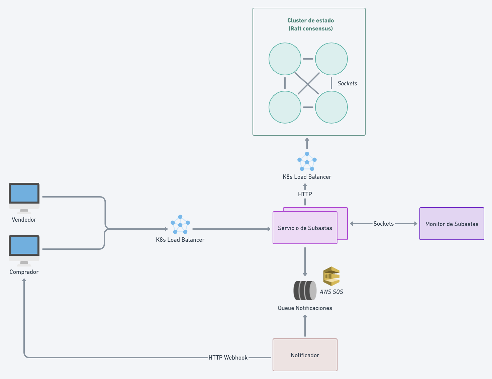

# Arquitecturas Concurrentes: Subastas

## Arquitectura


### Servicio de Subastas
Este componente es el WebClient de la aplicación, y es el único expuesto hacia hacia internet mediante un Ingress. Contiene los endpoints para crear subastas, registrar compradores, ofertar y cancelar una subasta, además de planificar el fin las subastas en progreso.
Se encarga además de generar las notificaciones a compradores cuando corresponda, oficiando de productor, a través de una cola de mensajes.
Se comunica mediante sockets con el Monitor de Subastas, y reporta la creación de nuevas subastas a este.
El servicio escala horizontalmente, en base a consumo de cpu con un HorizontalPodAutoscaler, y se encuentra detrás de un balanceador de carga.

#### Notificador
El consumidor encargado de enviar las notificaciones a compradores, está abstraído en otro componente, lo que permite que también escale horizontalmente si se lo requiere a partir de la carga de eventos por notificar que podría recibir la queue.
Se decidió incorporar este tipo de mensajería ya la misma naturaleza de la queue nos brinda resiliencia "out of the box". Si un evento de notificación fuera recibido y se fallara en su entrega, el consumer fallaría en dar el ack y pasado el visibility timeout se reintentaría el envío del mensaje. Además, el recurso externo nos desacopla del estado del consumidor, haciendo que el mensaje pueda encolarse aunque el servicio estuviera caido, para procesarse al momento de volver a estar disponible.

### Monitor de Subastas
Este componente almacena referencias a las subastas en progreso, y si se están llevando con normalidad. 
En caso de una falla de un nodo de Servicio de Subasta, el monitor detecta qué subastas necesitan ser replanificadas, para que luego, cuando algún nodo de Servicio de Subastas se recupere, este pueda conocer qué subastas deberá llevar.

### Estado de Subastas
Los servicios de subasta delegan el estado a este componente, siendo un cluster que implementa el algoritmo de consenso Raft.
Esto los hace eventualmente consistentes ante una partición en el cluster.

## Modelo de Concurrencia
Se implementó la solución aprovechando el Event Loop de NodeJS, que se ajusta acordemente a la carga I/O bound de la aplicación con comunicación constantes entre servicios y clientes. El procesamiento CPU Bound es ligero.

## Sobre el Teorema de CAP
La arquitectura presentada se ubica en esquema AP. Analizando desde el Estado de Subastas, en caso de una partición de red, la implementación con Raft, perimte que las particiones generadas, elijan un nuevo líder, manteniendo la disponibilidad del sistema, aunque sacrificando una consistencia fuerte en todo el despliegue. La consistencia se recuperará una vez que finalice la partición, aceptando el estado provisto por el nuevo líder. 

#### Oportunidades de Mejora
- El Monitor podría persistir el estado en otro cluster de estado (o el mismo), para evitar la pérdida de información en caso de falla. Hoy en día es un SPoF.
- Esto permitiría escalarlo además, ya que no tendría estado.

## How to run in (MacOS)

Be sure to edit `/etc/hosts`, adding:

```
127.0.0.1 subastas.com
```

You will need to build the images for each component and move them to the cluster.
Also, make sure you have the `ingress` addon enabled in your minikube cluster:

```bash
minikube addons enable ingress
```

1. Start a kuberneters cluster, `minikube start`
2. `minikube tunnel`
3. `cd k8s && kubectl apply -f .`
4. Configure the queue in the localstack with
```
aws configure
test
test
us-east-1

aws --endpoint-url=http://localhost:4566 sqs create-queue --queue-name notification-events.fifo --attributes "FifoQueue=true"
```
5. Check with `curl subastas.com/up`
6. Have fun!
