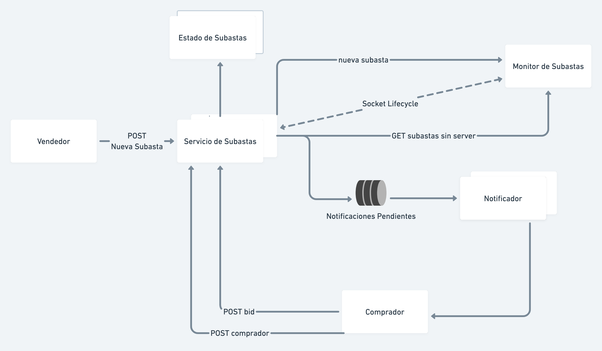

# Arquitecturas Concurrentes: Subastas

## Arquitectura


### Servicio de Subastas
Este componente es el entrypoint para el cliente, y es el único expuesto hacia afuera del cluster de Kubernetes. Contiene los endpoints para crear subastas, registrar compradores, ofertar y cancelar una subasta, además de agendar el fin las subastas en progreso.
Se encarga además de generar las notificaciones a compradores cuando corresponda, oficiando de productor, a través de una cola de mensajes.
Se comunica mediante sockets con el Monitor de Subastas, y reporta la creación de nuevas subastas a este
El servicio escala horizontalmente, y se encuentra detrás de un balanceador de carga. 

#### Notificador
El consumidor encargado de enviar las notificaciones a compradores, está abstraído en otro componente, lo que permite que también escale horizontalmente si se lo requiere.
El uso de la cola de mensajes agrega resiliencia a este aspecto de la solución.

### Monitor de Subastas
Este componente almacena las subastas en progreso, y si se están llevando con normalidad. 
En caso de una falla de un nodo de Servicio, el monitor nota que subastas en progreso que necesitan ser agendadas nuevamente. En el momento que un nodo de subastas se recupera, este consulta al para conocerlas, y continuar con el procesamiento.

### Estado de Subastas
Los servicios de subasta delegan el estado a este componente, siendo un cluster que implementa el algoritmo de consenso Raft.
Esto los hace eventualmente consistentes ante una partición en el cluster.

## Modelo de Concurrencia
Se implementó la solución aprovechando el Event Loop de NodeJS, que se ajusta acordemente a las llamadas de entrada y salida constantes entre servicios y para los clientes. El procesamiento CPU es ligero.

## How to run in (MacOS)

Be sure to edit `/etc/hosts`, adding:

```
127.0.0.1 subastas.com
```

1. Start a kuberneters cluster, `minikube start`
2. `minikube tunnel`
3. `cd k8s && kubectl apply -f .`
4. Configure the queue in the localstack with
```
aws configure
test
test
us-east-1

aws --endpoint-url=http://localhost:4566 sqs create-queue --queue-name notification-events.fifo --attributes "FifoQueue=true"
```
5. Check with `curl subastas.com/up`
6. Have fun!